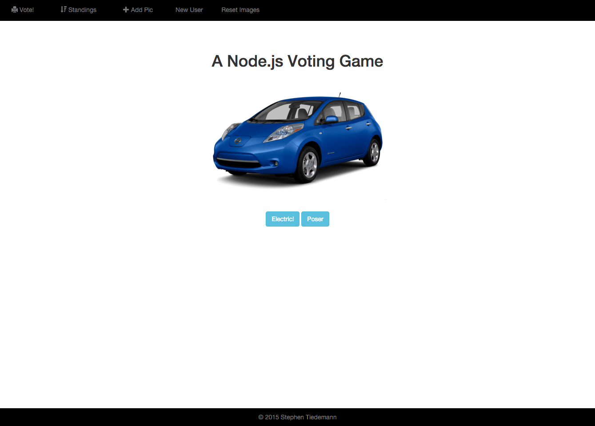
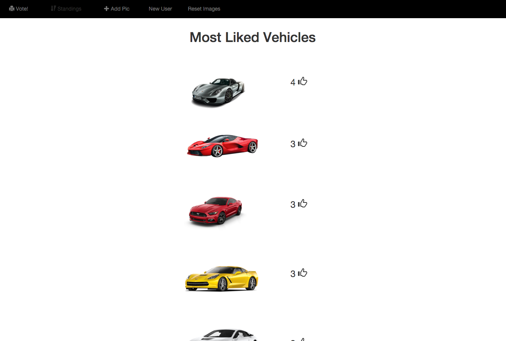

# electricornot - A node.js Voting App

This app is a simple voting app that is built using node.js and Express with MongoDb and Mongoose for data access.  A user can cycle through a list of cars and they can cast an up or down vote on each vehicle. They can look at the statistics to see the total votes on each car. The app is set up that for each session a user will be unable to vote on the same car twice.

